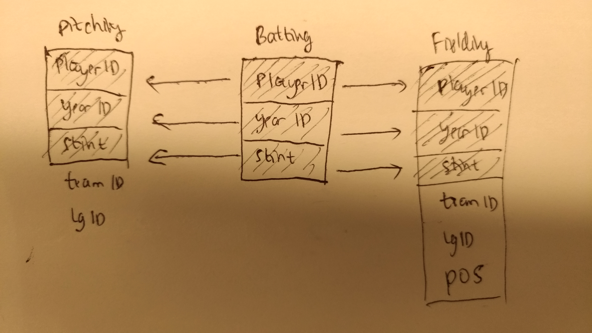

```{r setup, include=FALSE}
knitr::opts_chunk$set(echo = TRUE)
library('tidyverse')

# Datasets
library('nycflights13')
library('Lahman')
library('babynames')
library('nasaweather')
library('fueleconomy')
library('viridis')
```


# ------------------- 13.2.1 Exercise -------------------------
## 1. Imagine you wanted to draw (approximately) the route each plane flies from its origin to its destination. What variables would you need? What tables would you need to combine?
```{r soal_1_code, echo=FALSE}
(flights_coords <- flights %>%
  select(origin, dest) %>%
  inner_join(select(airports, origin = faa, ori_lat = lat, ori_lon = lon), by = 'origin') %>%
  inner_join(select(airports, dest = faa, dest_lat = lat, dest_lon = lon), by = 'dest')
)

us_state <- map_data("state")
flights_coords %>%
  unique() %>%
  ggplot() + 
  geom_polygon(data = us_state,
               aes(long, lat, group = group),
               fill = "white", colour = "black"
               ) + 
  geom_segment(aes(x = ori_lon, y = ori_lat, xend = dest_lon, yend = dest_lat), size = 0.1,
               arrow = arrow(angle = 20, length = unit(0.1, "inches"), type = "closed")) + 
  coord_quickmap()

```

## 2. I forgot to draw the relationship between weather and airports. What is the relationship and how should it appear in the diagram?
relationship should be like 
`airports$faa` -----> `weather$origin`
weather connects to airports via single variable `faa`

`airports$faa` is a primary key in `airports` each for unique airports
`weather$origin` is a foreign key in `weather` that connect weather for each unique airports

## 3. weather only contains information for the origin (NYC) airports. If it contained weather records for all airports in the USA, what additional relation would it define with flights?
first of all, many destination in `flights` table is not contained in `weather`, 
so if `weather` table has records for all airports in USA (including Honolulu, etc.), we then should split the destination arrival time into `dest_year`, `dest_month`, `dest_day`, and `dest_hour` to connect with weather tables.
then the connection would be like this:
`flights`                                                      ---> `weather`
`dest_year` | `dest_month` | `dest_day` | `dest_hour` | `dest` ---> `year` | `month` | `day` | `hour` | `origin`

## 4. We know that some days of the year are “special”, and fewer people than usual fly on them. How might you represent that data as a data frame? What would be the primary keys of that table? How would it connect to the existing tables?
create new data frame `special_day` that have year, month, and day of any special day like Ied Fitr, Christmas, New Year, etc. the primary key would be `year` `month` and `day`


# ------------------- 13.3.1 Exercise -------------------------
## 1. Add a surrogate key to flights.
adding ID, this ID has meaning of sorting flights from earliest departure
```{r soal_1_code, echo=FALSE}
flights %>%
  arrange(year, month, day, sched_dep_time) %>%
  mutate(ID = row_number()) %>%
  select(ID, everything())
```

## 2. Identify the keys in the following datasets
1. `Lahman::Batting`,
2. `babynames::babynames`
3. `nasaweather::atmos`
4. `fueleconomy::vehicles`
5. `ggplot2::diamonds`
(You might need to install some packages and read some documentation.)

1. `Lahman::Batting` has combined `playerID`, `yearID`, and `stint` as primary key
```{r soal_2_code_1}
Lahman::Batting %>%
  group_by(playerID, yearID, stint) %>%
  mutate(n = n()) %>%
  select(n, everything()) %>%
  filter(n>1)
```

2. `babynames::babynames` has combined `year`, `sex`, `name` as primary key
```{r soal_2_code_2}
babynames::babynames %>%
  group_by(year, sex, name) %>%
  mutate(n = n()) %>%
  select(n, everything()) %>%
  filter(n>1)
```

3. `nasaweather::atmos` has combined `lat`, `long`, `year`, `month` as primary key
```{r soal_2_code_3}
nasaweather::atmos %>%
  group_by(lat, long, year, month) %>%
  mutate(n = n()) %>%
  select(n, everything()) %>%
  filter(n>1)
```

4. `fueleconomy::vehicles` has `id` as primary key
```{r soal_2_code_4}
fueleconomy::vehicles %>%
  count(id) %>%
  filter(n>1)
```

5. `ggplot2::diamonds` has no key
```{r soal_2_code_5}
diamonds %>%
  count(cut, color, clarity) %>%
  filter(n>1)
```

## 3. Draw a diagram illustrating the connections between the `Batting`, `Master`, and `Salaries` tables in the Lahman package. Draw another diagram that shows the relationship between `Master`, `Managers`, `AwardsManagers`.
How would you characterise the relationship between the Batting, Pitching, and Fielding tables?

`Salaries`, `Master`, `Battling`


`Master`, `Managers`, `AwardsManagers`


`Pitching`, `Battling`, `Fielding`



# ------------------- 13.4.6 Exercise -------------------------
## 1. Compute the average delay by destination, then join on the `airports` data frame so you can show the spatial distribution of delays. Here’s an easy way to draw a map of the United States:
```{r soal_1}
airports %>%
  semi_join(flights, c("faa" = "dest")) %>%
  ggplot(aes(lon, lat)) +
    borders("state") +
    geom_point() +
    coord_quickmap()

# the answer
flights %>%
  filter(!is.na(arr_delay)) %>%
  group_by(dest) %>%
  summarise(avg_delay = mean(arr_delay)) %>%
  inner_join(airports, by = c(dest = "faa")) %>%
  ggplot(aes(lon, lat)) +
    borders("state") +
    geom_point(aes(color = avg_delay)) +
    coord_quickmap()
```
(Don’t worry if you don’t understand what `semi_join()` does — you’ll learn about it next.)
You might want to use the `size` or `colour` of the points to display the average delay for each airport.

## 2. Add the location of the origin and destination (i.e. the `lat` and `lon`) to `flights`.
```{r soal_2_code, echo=FALSE}
flights %>%
  left_join(select(airports, faa, lat, lon), 
            by = c(origin = 'faa')) %>%
  left_join(select(airports, faa, lat, lon), 
            by = c(dest = 'faa'), suffix = c("_origin", "_dest"))
```

## 3. Is there a relationship between the age of a plane and its delays?
It's looks like the delay incresing with age until 10 years, and then it drop. We lack of flight data of age 30++ so the plot looks spread.
```{r soal_3_code, echo=FALSE}
delay <- flights %>%
  # filtering NA delay
  filter(!is.na(arr_delay), !is.na(dep_delay)) %>%
  select(tailnum, arr_delay, dep_delay, year) %>%
  # joining with planes table
  left_join(select(planes, tailnum, plane_year = year), by = "tailnum") %>%
  # calculate age
  mutate(age = year - plane_year) %>%
  # filtering NA age
  filter(!is.na(age)) %>%
  # grouping delay each age
  group_by(age) %>%
  summarise(
    arr_sd = sd(arr_delay),
    dep_sd = sd(dep_delay),
    arr_delay = mean(arr_delay),
    dep_delay = mean(dep_delay),
    n_flights = n()
  )

# curve age vs average dep_delay
delay %>%
  ggplot(aes(x = age, y = dep_delay)) +
  geom_point(aes(size = n_flights), alpha = 1/3) +
  geom_smooth(se = FALSE)

  # # 95% confidence interval
  # geom_ribbon(mapping = aes(ymax = dep_delay + 1.96 * dep_sd / sqrt(n_flights),
  #                 ymin = dep_delay - 1.96 * dep_sd / sqrt(n_flights)
  #                 ),
  #             alpha = 1/3
  #             )


# curve age vs average arr_delay
delay %>%
  ggplot(aes(x = age, y = arr_delay)) +
  geom_point(aes(size = n_flights), alpha = 1/3) +
  geom_smooth(se = FALSE)

  # # 95% confidence interval
  # geom_ribbon(mapping = aes(ymax = arr_delay + 1.96 * arr_sd / sqrt(n_flights),
  #                 ymin = arr_delay - 1.96 * arr_sd / sqrt(n_flights)
  #                 ),
  #             alpha = 1/3
  #             )
```

## 4. What weather conditions make it more likely to see a delay?
dependent ~ independent
delay ~ weather_parameters

```{r soal_4_code, echo=FALSE}
## Joining the table
delay_weather <- flights %>%
  # filter NA delay
  filter(!is.na(dep_delay)) %>%
  select(origin, year, month, day, hour, dep_delay) %>%
  inner_join(weather, by = c("origin" = "origin", "year" = "year", "month" = "month", "day" = "day", "hour" = "hour"))
```

```{r looping group_by, echo=FALSE}
## Because too much weather parameters to look up, why not using loop?
# Create grouping summarising and plotting function
test_func <- function(mydf, var) {
  print(
    # Grouping and Summarising
    mydf %>% 
      filter(!is.na(var)) %>%
      group_by_(var) %>% 
      summarise(
        mean = mean(dep_delay), 
        sd = sd(dep_delay),
        n = n(),
        conf = 1.96 * sd / sqrt(n)      
      ) %>%
      
      # Plotting
      ggplot(aes(x = .[[var]], y = mean)) + geom_point() + geom_smooth(se = FALSE) + 
      # 95% confidence interval
      geom_ribbon(mapping = aes(ymax = mean + conf,
                                ymin = mean - conf),
                  alpha = 1/3
                  ) + 
      ggtitle(sprintf("Average Delay vs %s", var)) +
      xlab(var) + ylab("Average Delay") + 
      scale_y_continuous(breaks = seq(0, 70, by = 10)) +
      coord_cartesian(ylim = c(0,70))
    )
}

# Create a loop
for (column in colnames(delay_weather[7:15])) {
  test_func(delay_weather, column)
}

# other ways, facet grid!
```

From plotting through various weather parameter, we can see that:
- wind_gust, show increasing delay, confidential until 0-30 mph
- precipitation, show massive increase in delay, confidential 0 - 0.1 inches, later got too much variance and big confidence interval
- wind_speed, show small increase, confidential until 20 mph
- wind_direction, increasing until peak in 100 degree, and start decreasing
- temp, humidity, dewpoint, and pressure is not give so much insight, too variable
- visibility, delay is decrasing slightly the higher the visibility

so from this, we'll likely see delay when :
1. precipitation is high
2. wind_speed is high
3. wind_direction around 100 degrees
4. gust speed is high
5. and visibility is low

## 5. What happened on June 13 2013? Display the spatial pattern of delays, and then use Google to cross-reference with the weather.
There was a large series of storms in the south eastern US at that time. This is confirmed by spatial delay pattern which tells highest delay in south eastern US.
```{r soal_5_code, echo=FALSE}
flights %>%
  filter(!is.na(arr_delay), year == 2013, month == 6, day == 13) %>%
  group_by(dest) %>%
  summarise(
    avg_delay = mean(arr_delay),
    n_flights = n()
  ) %>%
  inner_join(airports, by = c(dest = 'faa')) %>%
  ggplot(aes(x = lon, y = lat)) +
  borders("state") +
  geom_point(aes(color = avg_delay, size = n_flights)) +
  coord_quickmap() + scale_colour_viridis()
```

# ------------------- 13.5.1 Exercise -------------------------
## 1. What does it mean for a flight to have a missing tailnum? What do the tail numbers that don’t have a matching record in planes have in common? (Hint: one variable explains ~90% of the problems.)

so missing tailnum have something in common, they correspond to cancelled flights, because they don't have any information on departure/arrival time and delay, even airtime
```{r soal_1_code, echo=FALSE}
flights %>%
  anti_join(planes, by = "tailnum") %>%
  filter(is.na(tailnum)) %>%
  count(carrier)
  # count(arr_delay)
  # count(air_time)
  # count(dep_time)
  # count(arr_time)
```

So most of the "don't match" planes come from carrier AA and MQ
With total combined proportion of 90% "don't match" planes and almost all of AA and MQ planes are not registered with 71% for AA and 98% for MQ

```{r soal_1_code_2, echo=FALSE}
# count how many "don't match" tailnum from each carrier
dont_match <- flights %>%
  anti_join(planes, by = "tailnum") %>%
  group_by(carrier) %>%
  summarise(n = n_distinct(tailnum, na.rm = FALSE))

# count how many total tailnum from each carrier
total <- flights %>%
  group_by(carrier) %>%
  summarise(n_total = n_distinct(tailnum, na.rm = FALSE))

# Let's find out
dont_match %>%
  inner_join(total, by = "carrier") %>%
  mutate(pct_dont_match = n / sum(n) * 100,
         pct_total = n / n_total * 100 )
```

## 2. Filter flights to only show flights with planes that have flown at least 100 flights.
```{r soal_2_code, echo=FALSE}
flights %>%
  semi_join(
    flights %>%
      # filter cancelled flights
      filter(!is.na(dep_delay)) %>%
      group_by(tailnum) %>%
      summarise(n = n()) %>%
      filter(n >= 100),
    by = "tailnum"
  )
```

## 3. Combine fueleconomy::vehicles and fueleconomy::common to find only the records for the most common models.
```{r soal_3_code, echo=FALSE}
fueleconomy::vehicles %>%
  semi_join(fueleconomy::common, by = c("make", "model"))
```

## 4. Find the 48 hours (over the course of the whole year) that have the worst delays. Cross-reference it with the weather data. Can you see any patterns?
How can I grouping by continuous 48 hours

timeframe     avg_delay
1 1h - 3 1h   x1
1 2h - 3 2h   x2
1 3h - 3 3h   x3
```{r soal_4_code, echo=FALSE}

```

## 5. What does `anti_join(flights, airports, by = c("dest" = "faa"))` tell you? What does `anti_join(airports, flights, by = c("faa" = "dest"))` tell you?
- `anti_join(flights, airports, by = c("dest" = "faa"))`
  find flights which the destination is not recorded on `airports` faa list
- `anti_join(airports, flights, by = c("faa" = "dest"))`
  find airports which were not a destination in `flights`

## 6. You might expect that there’s an implicit relationship between plane and airline, because each plane is flown by a single airline. Confirm or reject this hypothesis using the tools you’ve learned above.

To reject statement "each plane is flown by a single airline", we have to find plane which has flown with different airlines.
there are 17 planes which has flown with 2 different airplanes

```{r soal_6_code, echo=FALSE}
  flights %>%
  filter(!is.na(tailnum)) %>%
  distinct(tailnum, carrier) %>%
  count(tailnum) %>%
  filter(n>1)
```


